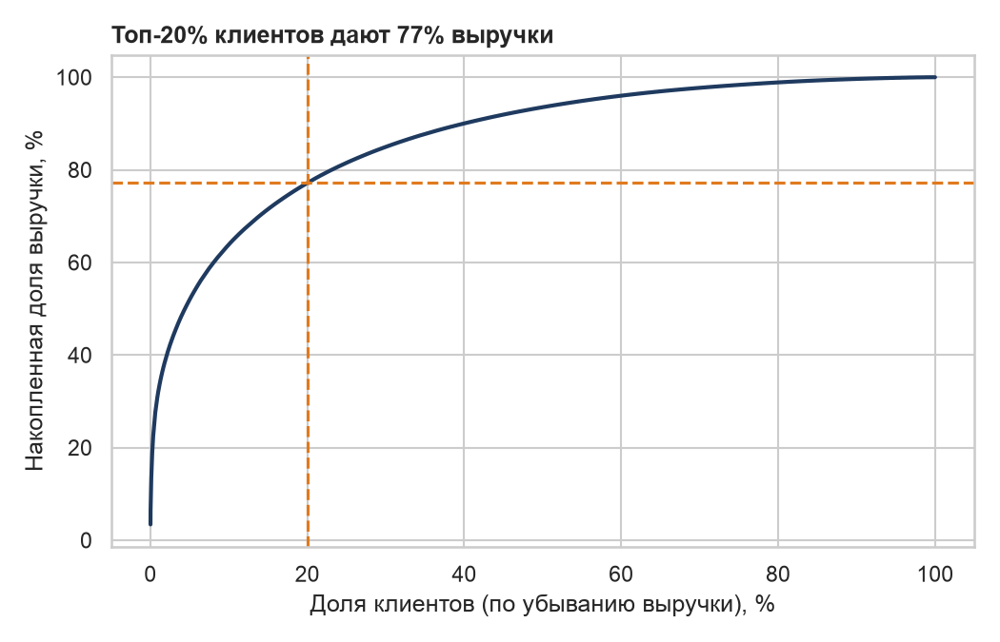
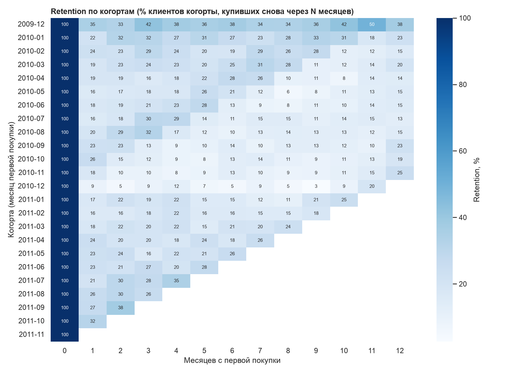
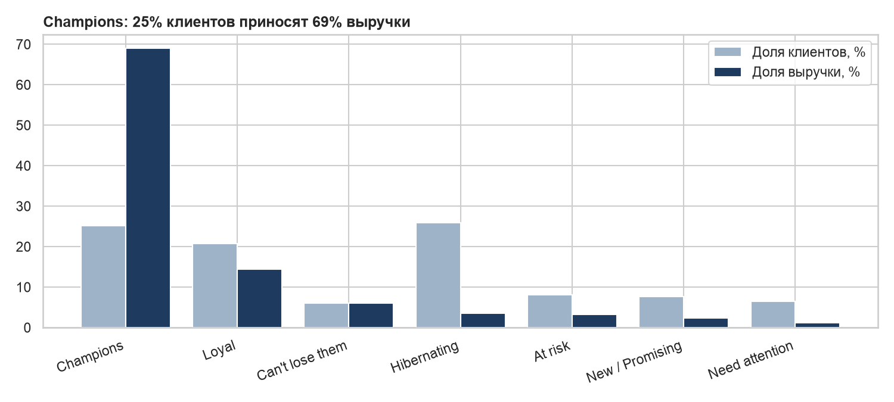

# RFM- и когортный анализ онлайн-ритейлера

**Задача:** понять, на каких клиентах держится выручка интернет-магазина, насколько хорошо он удерживает покупателей, и предложить, с какими сегментами работать в первую очередь.

**Стек:** PostgreSQL 17 (CTE, оконные функции) · Python (pandas, psycopg) · matplotlib / seaborn · Plotly

**Данные:** [UCI Online Retail II](https://archive.ics.uci.edu/dataset/502/online+retail+ii) — 1 067 371 строка транзакций британского онлайн-магазина подарков (дек 2009 — дек 2011). Значительная часть клиентов — оптовые покупатели. После очистки осталось 776 579 строк: 5 852 клиента, 36 594 заказа, £17,1 млн выручки.

---

## Главные выводы

| # | Вывод | Цифра |
|---|---|---|
| 1 | Выручка сильно сконцентрирована | **Топ-20% клиентов дают 77% выручки**, топ-1% — 32% |
| 2 | Ядро бизнеса — сегмент Champions | **25% клиентов → 69% выручки**; в среднем 15,5 заказа и £8 тыс. на клиента |
| 3 | Удержание новых клиентов низкое | Через месяц после первой покупки возвращается **21%** клиентов, через 6 месяцев — **18,5%** |
| 4 | Бизнес не растёт, а держится на сезоне | Выручка янв–ноя 2011 к 2010: **+0,1%**; пик в сентябре–ноябре, на ноябрь приходится 15% выручки янв–ноя |
| 5 | Декабрьские новички почти не возвращаются | Когорта дек-2010 удерживается на уровне 3–12% (до следующего сезона) против ~20% у других когорт |
| 6 | Есть ценные «уходящие» клиенты | Сегмент *Can't lose them*: 356 клиентов, 6% выручки, но не покупали в среднем **341 день** |



## Retention по когортам

Когорта — месяц первой покупки. Видно, что удержание падает уже на первом месяце, а на 12-м месяце есть всплеск — клиенты возвращаются к следующему сезону подарков.



> Когорта 2009-12 «левоцензурирована»: данные начинаются с декабря 2009, поэтому в неё попали и давние клиенты. Её retention завышен, и при расчёте средних значений она исключена.

## RFM-сегменты

Recency, Frequency и Monetary оценены квинтилями (1–5) через `NTILE(5)` на дату 2011-12-10.

| Сегмент | Клиенты | Доля клиентов | Доля выручки | Дней с последней покупки | Заказов | Что делать |
|---|---:|---:|---:|---:|---:|---|
| Champions | 1 471 | 25,1% | 69,0% | 20 | 15,5 | Персональный менеджер, ранний доступ к новинкам, не давать лишних скидок |
| Loyal | 1 211 | 20,7% | 14,4% | 78 | 5,4 | Кросс-продажи, программа лояльности за объём |
| Can't lose them | 356 | 6,1% | 6,1% | 341 | 7,7 | **Приоритет №1 для возврата:** персональный win-back до начала сезона |
| Hibernating | 1 514 | 25,9% | 3,6% | 459 | 1,3 | Дешёвые массовые рассылки или не тратить бюджет |
| At risk | 472 | 8,1% | 3,3% | 381 | 3,0 | Реактивационная кампания с ограниченным бюджетом |
| New / Promising | 447 | 7,6% | 2,3% | 29 | 1,5 | Онбординг: вторая покупка в первые 30 дней |
| Need attention | 381 | 6,5% | 1,2% | 108 | 1,4 | Напоминание и подборка по прошлым покупкам |



## Рекомендации

1. **Защитить Champions.** 69% выручки зависит от четверти клиентов: потеря даже 10% этого сегмента стоит ~7% выручки. Нужен отдельный мониторинг оттока (например, алерт, если Champion не покупал дольше своего обычного интервала).
2. **Вернуть Can't lose them до сезона.** Это бывшие частые покупатели (7,7 заказа) с выручкой на уровне Loyal. Win-back в августе–сентябре, до пика спроса, даёт максимальный эффект.
3. **Работать над второй покупкой.** Главная потеря — в первый месяц (100% → 21%). Онбординг-цепочка для новых клиентов и стимул на вторую покупку дадут больше, чем привлечение ещё большего числа новичков.
4. **Не мерить сезонных новичков общими метриками.** Декабрьские покупатели почти не возвращаются: их стоит оценивать отдельно и не завышать на них прогноз LTV.
5. **Проверить эффект через эксперимент.** Каждую механику стоит запускать как A/B-тест на части сегмента, чтобы измерить инкрементальную выручку, а не корреляцию.

## Как устроен проект

```
sql/
  00_load.sql              загрузка CSV в PostgreSQL (\copy)
  01_clean.sql             очистка: отмены, возвраты, служебные позиции, дубликаты
  02_monthly_kpi.sql       выручка, заказы, клиенты, средний чек, YoY (LAG)
  03_cohort_retention.sql  когорты по месяцу первой покупки (MIN OVER, FIRST_VALUE)
  04_rfm_segments.sql      RFM-скоринг квинтилями (NTILE) и сегменты
  05_pareto_ltv.sql        кривая Парето (накопительная сумма в окне)
scripts/
  01_xlsx_to_csv.py        Excel → CSV
  setup_db.sh              создание базы и пользователя
  02_analysis.py           выполнение SQL, графики, ключевые метрики
  03_dashboard.py          интерактивный дашборд Plotly
reports/
  dashboard.html           интерактивный дашборд (открыть в браузере)
  figures/                 графики для README
  *.csv, key_metrics.json  результаты запросов
```

**Правила очистки** (`01_clean.sql`): убраны строки без `customer_id`, отменённые заказы (номер начинается с `C`), строки с `quantity ≤ 0` или `price ≤ 0`, служебные коды (доставка, комиссии, корректировки) и полные дубликаты.

## Запуск

```bash
python3 -m venv .venv && source .venv/bin/activate
pip install -r requirements.txt
# скачать online_retail_II.xlsx с UCI в папку data/
python scripts/01_xlsx_to_csv.py
./scripts/setup_db.sh                      # создаст базу retail и пользователя
for f in sql/00_load.sql sql/01_clean.sql; do psql -h localhost -U retail_analyst -d retail -f $f; done
python scripts/02_analysis.py
python scripts/03_dashboard.py
```

## Ограничения

- Данные одного британского онлайн-магазина с большой долей оптовиков: выводы о концентрации выручки нельзя напрямую переносить на продуктовый ритейл.
- RFM-пороги относительные (квинтили): при изменении базы клиенты могут переходить между сегментами без изменения поведения.
- Рекомендации — гипотезы; их эффект нужно проверять экспериментом.
